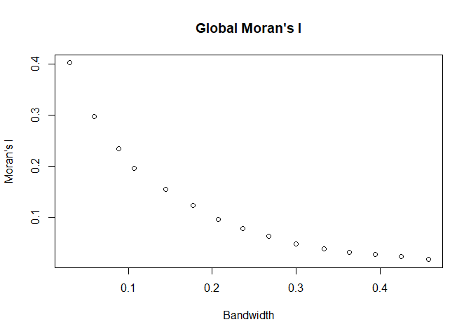
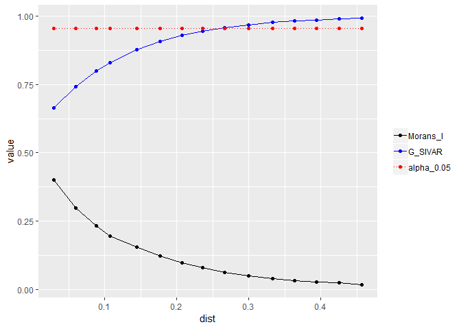

### Brief Description:

Among the exploratory spatial data analysis tools, there are indicators of spatial association, which measure the degree of spatial dependence of analysed data and can be applied to quantitative data. Another procedure available is geostatistics, which is based on the variogram, describing quantitatively and qualitatively the spatial structure of a variable. We present the implementation of the Global Spatial Indicator Based on Variogram – G-SIVAR in R software, which uses the concept of the variogram to develop a global indicator of spatial association. This method was proposed by **Cláudia Cristina Baptista Ramos Naizer** (ORCID: 0000-0001-8326-7082) and **Cira Souza Pitombo** (ORCID: 0000-0001-9864-3175). The code was developed by **Jorge Ubirajara Pedreira Junior** (ORCID: 0000-0002-8243-5395) and **David Souza Rodrigues** (ORCID: 0000-0002-8334-5260)

### (0) Preprocessing 
#### (0a) Loading packages:

```r
library(lctools); library(scales); library(sp); library(gstat); library(reshape2);
library(dplyr); library(bbmle); library(ggplot2); library(tinytex); library(knitr); library(tibble)
```

#### (0b) Reading data:
*Obs: specify accordingly to match file directory.*

```r
setwd("C:/Users/Jorge/Documents/g-sivar") 
```

*Obs: Choose either Centro SP (0b1) or Cidade Ficticia (0b2) datasets to calculate the G-SIVAR.*

#### (0b1) Centro SP data:


```r
dados <- read.table("2.CentroSP.txt",h=T)
```

####  (0b2) Cidade Ficticia data:

```r
#dados <- read.table("1.CidadeFicticiaBin.txt",h=T)
#nomes <- names(dados); nomes[2:3] <- c('x','y'); colnames(dados) <- nomes
```

### (1) Creating Spatial Data
* Scaling coordinates (0-1):

```r
x_nor = rescale(dados$x)
y_nor = rescale(dados$y)
```

#### (1a) Spatial points dataframe for Centro SP (non-scaled and scaled versions):

```r
#gd <- SpatialPointsDataFrame(coords=cbind(dados$x,dados$y),
                            # data = as.data.frame(dados$Avg_Tot_auto))
gd <- SpatialPointsDataFrame(coords=cbind(x_nor,y_nor),
                             data = as.data.frame(dados$Avg_Tot_auto))
```

#### (1b) Spatial points dataframe for Cidade Ficticia (non-scaled and scaled versions):

```r
#gd <- SpatialPointsDataFrame(coords=cbind(dados$x,dados$y),
                             #data = as.data.frame(dados$ESCOLHA))
#gd <- SpatialPointsDataFrame(coords=cbind(x_nor,y_nor),
                             #data = as.data.frame(dados$ESCOLHA))
```

### (2) Empirical and Theoretical Semivariograms
* Tests exponential, Spherical and Gaussian models and returns the best fit for anisotropical empirical semivariograms

```r
ev <- variogram(unlist(gd@data) ~ 1, data = gd, alpha=c(0,30,60,90,120,150),tol.hor = 22) 
tv <- fit.variogram(ev, vgm(c("Exp", "Sph", "Gau"))) 
```

#### (2a) Calculating anisotropy parameters (direction of maximum continuity and anisotropy ratio):

* **Direction of maximum continuity**: direction with lowest semivariance at range

```r
max_dir = as.numeric(names(which.min(tapply(ev$gamma,ev$dir.hor,max)))) 
```
* **Orthogonal direction**: with respect to the direction of maximum continuity

```r
ort_dir = abs(ifelse(90 + max_dir >= 180, max_dir - 90, max_dir + 90)) 
```

#### (2b) Fitting anisotropy models for `max_dir` and `ort_dir` to calculate anisotropy ratio:


```r
ev_max_dir <- variogram(unlist(gd@data) ~ 1, data = gd, alpha = max_dir,
                            tol.hor = 22)
ev_ort_dir <- variogram(unlist(gd@data) ~ 1, data = gd, alpha = ort_dir,
                            tol.hor = 22)
tv_max_dir <- fit.variogram(ev_max_dir, vgm(c("Exp", "Sph", "Gau")))
tv_ort_dir <- fit.variogram(ev_ort_dir, vgm(c("Exp", "Sph", "Gau")))
```

* Anisotropy ratio: 

```r
anis_ratio = tv_ort_dir$range[2]/tv_max_dir$range[2]
```

### (3) Simulation of uncorrelated spatial data using the real data coordinates

```r
semivar_simulation <- function(var,coords){
  # Checking variable type (continuous/binary):
  var = unlist(var)
  type = ifelse(any(as.integer(var) != var) || var > 2,"con","bin")
  
  # Computing Empirical and Theoretical Semivariograms for uncorrelated spatial data:
  n = 100
  sill_sim <<- vector("numeric", n)
  
  for (i in 1:n){
    # Generating random sample:
    if (type == 'con') {var_sim = runif(length(var),min(var),max(var))
    } else {var_sim = sample(0:1, length(var), replace = T)}
    
    # Creating SpatialPointsDataFrame for uncorrelated spatial data:
    g <- SpatialPointsDataFrame(coords = coords, data = as.data.frame(var_sim))
    
    # Storing simulated variogram sills in sill_sim:
    ev_s <<- variogram(var_sim ~ 1, data = g)
    tv_s <<- fit.variogram(ev_s, vgm(c("Exp", "Sph", "Gau")))
    sill_sim[i] <<- sum(tv_s$psill) # sum of nugget and partial sill = sill
  }
  # Tossing outliers out to avoid a skewed sill_sim distribution:
  Q1 = quantile(sill_sim, .25); Q3 = quantile(sill_sim, .75)
  cond = (sill_sim > Q1 - 1.5*(Q3 - Q1)) & (sill_sim < Q3 + 1.5*(Q3 - Q1))
  # Generating a bootstrap sample without outliers (n = 100):
  sill_sim <<- sample(sill_sim[cond], n, replace = T)
}
```

* Calling `semivar_simulation` function:

```r
semivar_simulation(gd@data,gd@coords)
```

### (4) Semivariance Scaling
#### (4a) Centering the simulated data on 1:

```r
sill_sim_c <- sill_sim/mean(sill_sim)
```

#### (4b) Estimating mean and standard deviation of the distribution of `sill_sim_c` via Maximum Likelihood Estimation (MLE):

```r
m <- mle2(sill_sim_c ~ dnorm(mean=mu,sd=sd),start=list(mu=0.1,sd=0.1),
          data=data.frame(sill_sim_c))
```


#### (4c) Computing scaled theoretical semivariogram model (with anisotropy):
* Model parameters (coercing sill to 1 and adjusting partiall sill and nugget accordingly):

```r
tv_sc <-  vgm(psill = tv$psill[2]/sum(tv$psill), model = as.vector(tv$model[2]),
              range = tv$range[2], nugget = tv$psill[1]/sum(tv$psill),
              anis = c(max_dir,anis_ratio))
```

* Calculating semivariance values for each distance:

```r
var_func <- variogramLine(tv_sc, dist_vector = ev$dist[ev$dir.hor==max_dir])
```

### (5) Computing Moran's I 
* For each empirical semivariogram distance measure:

```r
moran <- moransI.v(gd@coords, ev$dist[ev$dir.hor==max_dir],
                   unlist(gd@data), family='fixed')
```



```r
moran <- as.data.frame(moran)
names(moran)[3] <- "Morans_I"
```

### (6) Hipothesis Test and Comparison to Moran's I
#### (6a) Comparison table:

```r
df = data.frame(dist = ev$dist[ev$dir.hor==max_dir], Morans_I = moran$Morans_I,
                pv_Morans_I = moran$`P-value res.`, G_SIVAR = var_func$gamma, 
                pv_G_SIVAR = pnorm(var_func$gamma, m@coef[1], m@coef[2]), 
                alpha_0.05 = rep(qnorm(0.05, m@coef[1], m@coef[2]),nrow(moran)))

as_tibble(df)
```

```
## # A tibble: 15 x 6
##      dist Morans_I pv_Morans_I G_SIVAR pv_G_SIVAR alpha_0.05
##     <dbl>    <dbl>       <dbl>   <dbl>      <dbl>      <dbl>
##  1 0.0300   0.402    3.77e- 37   0.663   6.23e-34      0.954
##  2 0.0598   0.297    1.02e-116   0.741   7.19e-21      0.954
##  3 0.0886   0.234    4.38e-150   0.799   2.61e-13      0.954
##  4 0.107    0.196    6.10e-168   0.829   4.67e-10      0.954
##  5 0.144    0.156    1.00e-176   0.877   4.79e- 6      0.954
##  6 0.177    0.123    1.21e-161   0.907   4.48e- 4      0.954
##  7 0.208    0.0968   2.05e-144   0.929   5.55e- 3      0.954
##  8 0.236    0.0789   1.54e-125   0.945   2.44e- 2      0.954
##  9 0.267    0.0629   1.10e-105   0.958   6.61e- 2      0.954
## 10 0.300    0.0483   1.50e- 82   0.969   1.30e- 1      0.954
## 11 0.333    0.0384   2.15e- 67   0.977   2.00e- 1      0.954
## 12 0.364    0.0328   2.75e- 62   0.982   2.60e- 1      0.954
## 13 0.394    0.0282   1.14e- 57   0.986   3.11e- 1      0.954
## 14 0.426    0.0237   5.06e- 52   0.990   3.54e- 1      0.954
## 15 0.458    0.0180   1.29e- 38   0.992   3.89e- 1      0.954
```

#### (6b) Plotting results:

```r
df_melt <- melt(df %>% select(dist,Morans_I,G_SIVAR,alpha_0.05), id = "dist")

ggplot(data = df_melt, aes(x = dist, y = value, colour = variable, linetype = variable)) +
  geom_line(aes(linetype=variable)) + geom_point() +
  scale_linetype_manual(values=c("solid","solid","dotted")) +
  scale_color_manual(values=c('black','blue','red')) +
  theme(legend.title = element_blank())
```




